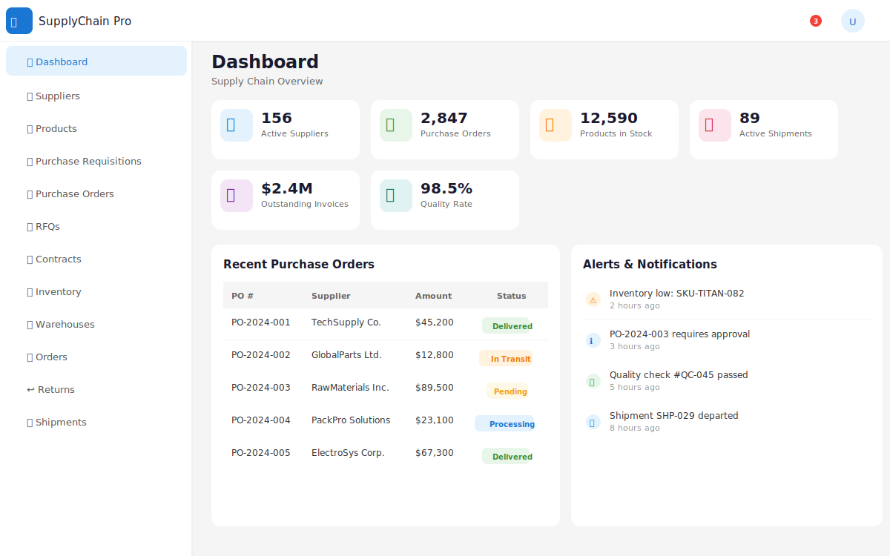
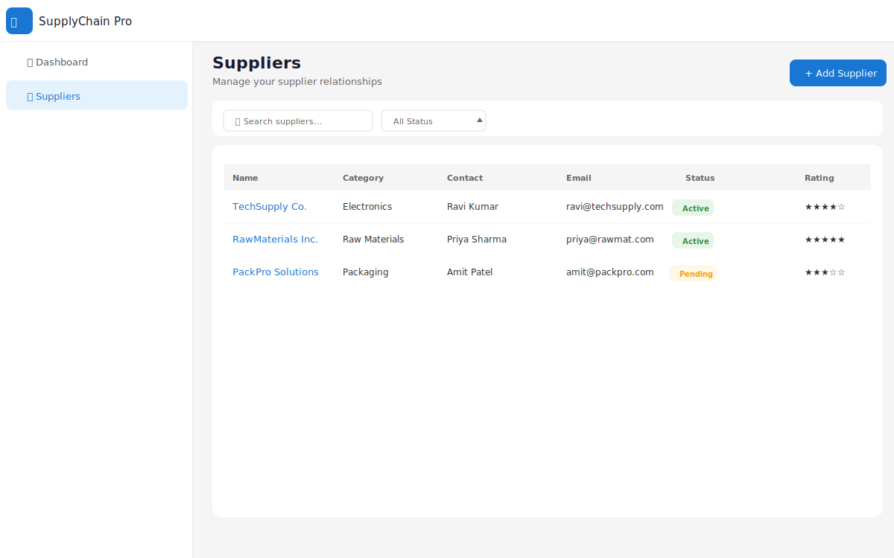
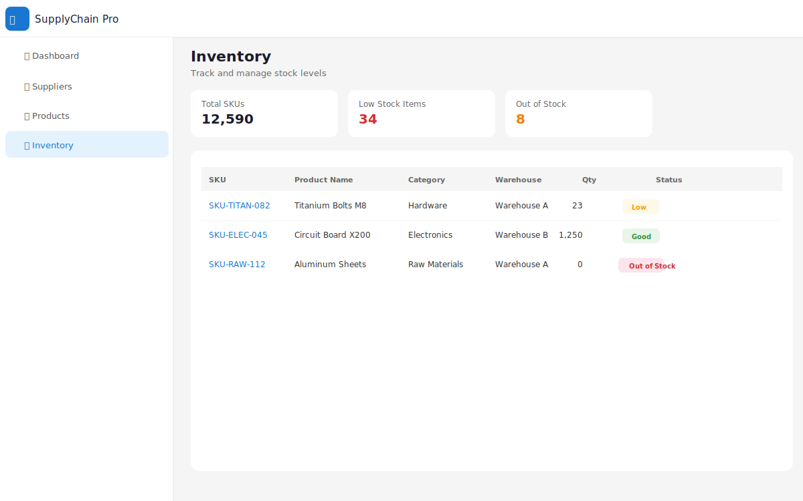
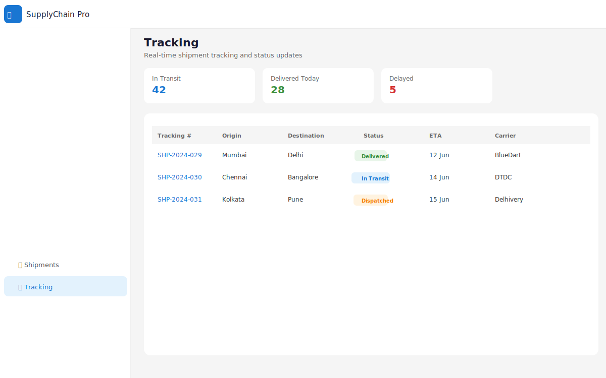
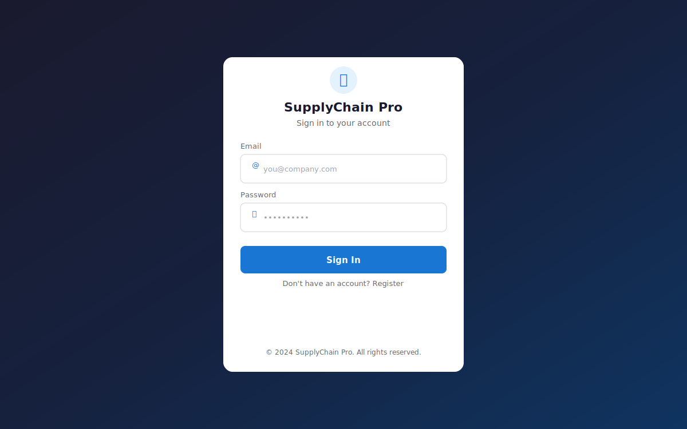
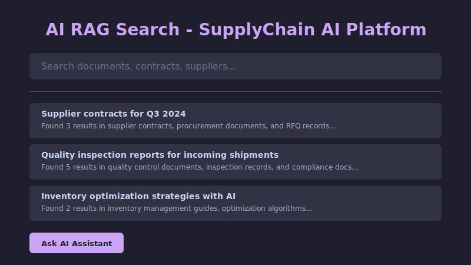
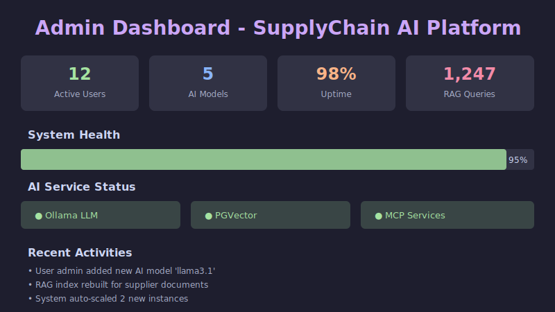

# SupplyChain AI Platform

> **Enterprise-Grade AI-Enhanced Supply Chain Management System** — A production-ready microservices platform built with Spring Boot 3.3, Spring Cloud 2023, and Angular 18, featuring advanced RAG, MCP, and agentic AI capabilities.

[](https://adoptium.net/)
[](https://spring.io/projects/spring-boot)
[](https://angular.dev/)
[](https://www.postgresql.org/)
[](https://kafka.apache.org/)
[](https://redis.io/)
[](https://www.docker.com/)
[](https://docs.langchain4j.dev/)
[](https://docs.spring.io/spring-ai/reference/)

---

## 📸 Screenshots

| Dashboard | Suppliers |
|:----------|:--------:|
|  |  |

| Inventory | Shipments & Tracking |
|:----------|:--------:|
|  |  |

| Login |
|:----------:|
|  |

| AI Demand Forecast |
|:----------:|
|  |

| AI RAG Search | Admin Dashboard |
|:----------:|:--------:|
|  |  |

---

## 📋 Table of Contents

- [Architecture Overview](#-architecture-overview)
- [Project Structure](#-project-structure)
- [Service Map & Ports](#-service-map--ports)
- [Tech Stack](#-tech-stack)
- [AI/RAG Capabilities](#-airag-capabilities)
- [Data Flow](#-data-flow)
- [Getting Started](#-getting-started)
- [API Documentation](#-api-documentation)
- [Security](#-security)
- [Monitoring & Observability](#-monitoring--observability)
- [Development Guide](#-development-guide)
- [Deployment](#-deployment)
- [Contributing](#-contributing)
- [License](#-license)

---

## 🏗 Architecture Overview

```
┌─────────────────────────────────────────────────────────────────────────────────┐
│                          CLIENT LAYER                                            │
│  ┌──────────────────────────────────────────────────────────────────────────────┐   │
│  │           Angular 18 SPA (supplychainai-ui)                                   │   │
│  │  ┌──────┐ ┌──────┐ ┌──────┐ ┌───────┐ ┌──────┐ ┌──────┐ ┌──────┐ ┌──────┐ ┌──────┐  │   │
│  │  │Auth  │ │Dash- │ │Suppl-│ │Invent-│ │Orders│ │Invoi-│ │More..│ │Admin │ │AI   │  │   │
│  │  │Module│ │board │ │iers  │ │ory    │ │      │ │ces   │ │      │ │Panel │ │Chat│  │   │
│  │  └──────┘ └──────┘ └──────┘ └───────┘ └──────┘ └──────┘ └──────┘ └──────┘ └──────┘  │   │
│  └──────────────────────────────────────────────────────────────────────────────┘   │
└──────────────────────────────┬───────────────────────────────────────────────────┘
                               │ HTTP / HTTPS
                               ▼
┌─────────────────────────────────────────────────────────────────────────────────┐
│                         API GATEWAY LAYER                                        │
│  ┌──────────────────────────────────────────────────────────────────────────────┐   │
│  │            Spring Cloud Gateway (Port 8080)                                   │   │
│  │  ┌──────────┐ ┌──────────┐ ┌──────────┐ ┌──────────────────────┐ ┌──────────┐  │   │
│  │  │JWT Auth  │ │ Rate     │ │ Route    │ │ CORS / Security      │ │ AI Proxy │   │   │
│  │  │ Filter   │ │ Limiter  │ │ Locator  │ │ Headers              │ │ Gateway  │   │   │
│  │  └──────────┘ └──────────┘ └──────────┘ └──────────────────────┘ └──────────┘  │   │
│  └──────────────────────────────────────────────────────────────────────────────┘   │
└──────────┬───────────────────────────────────────────────────┬─────────────────────┘
           │                                                   │
           ▼                                                   ▼
┌──────────────────────────┐           ┌──────────────────────────────┐ ┌─────────────────┐
│   SERVICE REGISTRY       │◄─────────►│      CONFIG SERVER           │ │   OLLAMA LLM    │
│   (Eureka - Port 8761)   │           │  (Spring Cloud - Port 8888)  │ │ (Local Docker)  │
└──────────────────────────┘           └──────────────────────────────┘ └─────────────────┘
           │
           ▼
┌─────────────────────────────────────────────────────────────────────────────────┐
│                         MICROSERVICES LAYER                                      │
│                                                                                 │
│  ┌──────────────────────────────────────────────────────────────────────────────┐   │
│  │                    INFRASTRUCTURE SERVICES                                   │   │
│  │  ┌────────────────────┐ ┌────────────────────┐ ┌──────────────────┐ ┌─────────┐  │   │
│  │  │  Auth Service      │ │  User Service      │ │  Notification   │ │ Admin   │  │   │
│  │  │  (Port 8081)       │ │  (Port 8082)       │ │  (Port 8106)    │ │ Service │  │   │
│  │  │  JWT + RBAC        │ │  Profiles/Teams    │ │  Email/Push/SMS │ │ (8111)  │  │   │
│  │  │  PostgreSQL + Redis│ │  PostgreSQL + Mongo│ │  MongoDB + Redis │ │         │  │   │
│  │  └────────────────────┘ └────────────────────┘ └──────────────────┘ └─────────┘  │   │
│  │                                                                              │
│  │  ┌──────────────────────────────────────────────────────────────────────────────┐   │
│  │  │                    PROCUREMENT SERVICES                                   │   │
│  │  │  ┌────────────┐ ┌────────────┐ ┌────────────┐ ┌────────────┐ ┌─────────┐  │   │
│  │  │  │  Supplier  │ │  Purchase  │ │  Purchase  │ │    RFQ    │ ││ AI RAG  │  │   │
│  │  │  │  (8083)    │ │Requisition │ │   Order    │ │  (8086)   │ ││ Service │  │   │
│  │  │  └────────────┘ │  (8084)    │ │  (8085)    │ └────────────┘ ││ (8109)  │  │   │
│  │  │                 └────────────┘ └────────────┘              └─────────┘ │   │
│  │  └──────────────────────────────────────────────────────────────────────────────┘   │
│  │                                                                              │
│  │  ┌──────────────────────────────────────────────────────────────────────────────┐   │
│  │  │              INVENTORY & LOGISTICS SERVICES                                │   │
│  │  │  ┌──────────┐ ┌──────────┐ ┌──────┐ ┌────────┐ ┌──────────┐ ┌─────────┐  │   │
│  │  │  │ Product  │ │Inventory │ │Ware- │ │ Order  │ │ Return   │ ││ AI RAG  │  │   │
│  │  │  │ Catalog  │ │ (8089)   │ │house │ │(8091)  │ │ (8092)   │ ││ Service │  │   │
│  │  │  │ (8088)   │ │ Redis    │ │(8900) │ │        │ │          │ ││ (8109)  │  │   │
│  │  │  └──────────┘ └──────────┘ └──────┘ └────────┘ └──────────┘ └─────────┘ │   │
│  │  │  ┌──────────┐ ┌──────────┐ ┌──────────┐                            │   │
│  │  │  │  Route   │ │Tracking  │ │ Quality  │                            │   │
│  │  │  │ (8094)   │ │ (8095)   │ │ (8096)   │                            │   │
│  │  │  └──────────┘ └──────────┘ └──────────┘                            │   │
│  │  └──────────────────────────────────────────────────────────────────────────────┘   │
│  │                                                                              │
│  │  ┌──────────────────────────────────────────────────────────────────────────────┐   │
│  │  │                    FINANCE & PLANNING SERVICES                              │   │
│  │  │  ┌────────┐ ┌────────┐ ┌──────┐ ┌──────────┐ ┌─────────┐ ┌───────┐ ┌─────────┐  │   │
│  │  │  │Invoice │ │Payment │ │ Cost │ │Forecast  │ │Planning │ │ Search│ │ AI RAG │  │   │
│  │  │  │ (8100) │ │ (8101) │ │(8102)│ │ (8098)   │ │ (8099)  │ │ (8108)│ │ Service│  │   │
│  │  │  └────────┘ └────────┘ └──────┘ └──────────┘ └─────────┘ └───────┘ └─────────┘ │   │
│  │  └──────────────────────────────────────────────────────────────────────────────┘   │
│  │                                                                              │
│  │  ┌──────────────────────────────────────────────────────────────────────────────┐   │
│  │  │              ANALYTICS & CROSS-CUTTING SERVICES                              │   │
│  │  │  ┌─────────┐ ┌──────────┐ ┌─────────┐ ┌────────┐ ┌───────┐ ┌─────────┐ ┌─────────┐  │   │
│  │  │  │Supplier │ │  Report  │ │Analytics│ │Audit   │ │Search │ │Quarantine│ │ AI RAG │  │   │
│  │  │  │Portal   │ │ (8104)   │ │(8105)  │ │(8107)  │ │(8108) │ │(8097)   │ │ Service│  │   │
│  │  │  │(8103)   │ │          │ │         │ │MongoDB │ │       │ │         │ │(8109)  │  │   │
│  │  │  └─────────┘ └──────────┘ └─────────┘ └────────┘ └───────┘ └─────────┘ └─────────┘ │   │
│  │  └──────────────────────────────────────────────────────────────────────────────┘   │
│  │                                                                              │
│  │  ┌──────────────────────────────────────────────────────────────────────────────┐   │
│  │  │              AI & AGENTIC SERVICES                                          │   │
│  │  │  ┌──────────┐ ┌─────────┐ ┌──────────┐ ┌──────────┐ ┌─────────┐ ┌─────────┐  │   │
│  │  │  │ AI RAG   │ │ MCP     │ │  Admin   │ │  LLM     │ │  Vector │ │  Model  │  │   │
│  │  │  │Service   │ │Service  │ │Service   │ │Manager  │ │Store    │ │Registry │  │   │
│  │  │  │(8109)    │ │(8110)   │ │(8111)    │ │(Local)  │ │(PGVec)  │ │(Local)  │  │   │
│  │  │  └──────────┘ └─────────┘ └──────────┘ └──────────┘ └─────────┘ └─────────┘ │   │
│  │  └──────────────────────────────────────────────────────────────────────────────┘   │
│  └─────────────────────────────────────────────────────────────────────────────────┘
│                                    │
└────────────────────────────────────┼──────────────────────────────────────────────────┘
                                     │
                                     ▼
┌─────────────────────────────────────────────────────────────────────────────────┐
│                         DATA & MESSAGING LAYER                                   │
│                                                                                 │
│  ┌──────────┐ ┌──────────┐ ┌──────────┐ ┌──────────┐ ┌──────────────────┐   │
│  │PostgreSQL│ │ MongoDB  │ │  Redis   │ │  Kafka   │ │  Ollama / LLM   │   │
│  │  (16)    │ │   (7)    │ │  Cache   │ │  Event   │ │  (Local Docker) │   │
│  │ Relat-   │ │ Document │ │  Layer   │ │  Bus     │ │  Models         │   │
│  │ ional DB │ │  Store   │ │  Layer   │ │  Bus     │ │  (llama3.1, etc)│   │
│  └──────────┘ └──────────┘ └──────────┘ └──────────┘ └──────────────────┘   │
│                                                                                 │
└─────────────────────────────────────────────────────────────────────────────────┘
│                                    │
└────────────────────────────────────┼──────────────────────────────────────────────────┘
                                     │
                                     ▼
┌─────────────────────────────────────────────────────────────────────────────────┐
│                    MONITORING & OBSERVABILITY                                    │
│                                                                                 │
│  ┌──────────┐ ┌──────────┐ ┌──────────┐ ┌──────────┐ ┌──────────┐ ┌──────────┐   │
│  │Prometheus│ │ Grafana  │ │  Zipkin  │ │  Kafka   │ │  pgAdmin │ │ Ollama   │   │
│  │ (9090)   │ │ (3000)   │ │ (9411)   │ │  UI      │ │ (5050)   │ │ UI       │   │
│  │ Metrics  │ │Dashboard │ │Traces    │ │ (8090)   │ │Postgres  │ │ (11434)  │   │
│  └──────────┘ └──────────┘ └──────────┘ └──────────┘ └──────────┘ └──────────┘   │
└─────────────────────────────────────────────────────────────────────────────────┘
```

---

## 📁 Project Structure

```
supplychain-ai-platform/
├── 📂 backend/                          # Backend Microservices (34 total)
│   ├── 📂 service-registry/            # Eureka Service Discovery (Port 8761)
│   ├── 📂 config-server/               # Spring Cloud Config (Port 8888)
│   ├── 📂 api-gateway/                 # Spring Cloud Gateway (Port 8080)
│   ├── 📂 auth-service/                # JWT Authentication (Port 8081)
│   │
│   │   ── PROCUREMENT DOMAIN ──
│   ├── 📂 user-service/                # User Profiles (Port 8082)
│   ├── 📂 supplier-service/            # Supplier Management (Port 8083)
│   ├── 📂 purchase-requisition-service/ # PR Management (Port 8084)
│   ├── 📂 purchase-order-service/      # PO Management (Port 8085)
│   ├── 📂 rfq-service/                 # RFQ Management (Port 8086)
│   ├── 📂 contract-service/             # Contract Management (Port 8087)
│   │
│   │   ── INVENTORY & PRODUCT DOMAIN ──
│   ├── 📂 product-catalog-service/     # Product Catalog (Port 8088)
│   ├── 📂 inventory-service/           # Inventory Control (Port 8089)
│   ├── 📂 warehouse-service/           # Warehouse Mgmt (Port 8900)
│   │
│   │   ── ORDER & LOGISTICS DOMAIN ──
│   ├── 📂 order-service/               # Order Management (Port 8091)
│   ├── 📂 return-service/              # Returns Mgmt (Port 8092)
│   ├── 📂 shipment-service/            # Shipments (Port 8093)
│   ├── 📂 route-service/               # Route Planning (Port 8094)
│   ├── 📂 tracking-service/            # Shipment Tracking (Port 8095)
│   │
│   │   ── QUALITY & PLANNING DOMAIN ──
│   ├── 📂 quality-service/             # Quality Inspection (Port 8096)
│   ├── 📂 quarantine-service/          # Quarantine Mgmt (Port 8097)
│   ├── 📂 forecast-service/            # Demand Forecasting (Port 8098)
│   ├── 📂 planning-service/            # Supply Planning (Port 8099)
│   │
│   │   ── FINANCE DOMAIN ──
│   ├── 📂 invoice-service/             # Invoice Mgmt (Port 8100)
│   ├── 📂 payment-service/             # Payment Processing (Port 8101)
│   ├── 📂 cost-service/                # Cost Management (Port 8102)
│   │
│   │   ── PORTAL & ANALYTICS DOMAIN ──
│   ├── 📂 supplier-portal-service/     # Supplier Portal (Port 8103)
│   ├── 📂 report-service/              # Reporting Engine (Port 8104)
│   ├── 📂 analytics-service/           # Analytics & KPIs (Port 8105)
│   │
│   │   ── CROSS-CUTTING DOMAIN ──
│   ├── 📂 notification-service/        # Notifications (Port 8106)
│   ├── 📂 audit-service/               # Audit Logging (Port 8107)
│   ├── 📂 search-service/              # Search Engine (Port 8108)
│   │
│   │   ── AI & AGENTIC DOMAIN ──
│   ├── 📂 ai-rag-service/             # AI RAG Service (Port 8109)
│   ├── 📂 mcp-service/                # MCP Client Service (Port 8110)
│   ├── 📂 admin-service/               # Admin Service (Port 8111)
│   │
│   └── 📄 Each service contains:       # Standard microservice structure
│       ├── Dockerfile
│       ├── pom.xml
│       └── src/main/
│           ├── java/com/supplychainai/{domain}/
│           │   ├── Application.java          # Entry point
│           │   ├── config/                   # Service config
│           │   ├── controller/               # REST endpoints
│           │   ├── dto/                      # Data Transfer Objects
│           │   ├── model/                   # JPA/MongoDB entities
│           │   ├── repository/               # Data access layer
│           │   └── service/                  # Business logic
│           └── resources/
│               ├── application.yml           # Service config
│               └── db/migration/             # Flyway migrations
│
├── 📂 frontend/
│   └── 📂 supplychainai-ui/           # Angular 18 SPA
│       ├── src/app/
│       │   ├── core/                   # Auth, API, Guards, Interceptors
│       │   ├── layout/                 # Sidebar, Header
│       │   ├── shared/                 # Shared components
│       │   └── features/               # Feature modules (20+ total)
│       │       ├── auth/               # Login / Register
│       │       ├── dashboard/          # Overview & KPIs
│       │       ├── suppliers/          # Supplier management
│       │       ├── products/           # Product catalog
│       │       ├── inventory/          # Stock management
│       │       ├── orders/             # Order management
│       │       ├── invoices/           # Invoice management
│       │       ├── admin/              # Admin panel with AI features
│       │       └── ...                 # More feature modules
│       ├── angular.json
│       └── package.json
│
├── 📂 config-repo/                    # Shared configuration
│   └── application.yml                # Common config for all services
│
├── 📂 infra/                          # Infrastructure
│   ├── 📂 postgres/                   # PostgreSQL init scripts
│   │   └── init-schemas.sql           # Database schema creation
│   └── 📂 prometheus/                 # Prometheus monitoring
│       └── prometheus.yml            # Scrape configuration
│
├── 📄 docker-compose.yml              # Full orchestration (40+ containers)
├── 📄 pom.xml                         # Parent Maven POM (multi-module)
├── 📄 .env.example                    # Environment variables template
├── 📄 .gitignore
└── 📄 README.md                       # This file
```

---

## 🗺 Service Map & Ports

### Infrastructure Services
| Service | Port | Tech | Database | Description |
|---------|------|------|----------|-------------|
| 🔷 service-registry | `8761` | Eureka Server | - | Service discovery & health monitoring |
| ⚙️ config-server | `8888` | Spring Cloud Config | - | Centralized configuration management |
| 🚪 api-gateway | `8080` | Spring Cloud Gateway | Redis | API routing, JWT validation, rate limiting |
| 🔐 auth-service | `8081` | Spring Security | PostgreSQL + Redis | JWT auth, RBAC, refresh tokens |

### Procurement Domain
| Service | Port | Tech | Database | Description |
|---------|------|------|----------|-------------|
| 👤 user-service | `8082` | Spring Boot | PostgreSQL | User profiles, addresses, teams |
| 🏭 supplier-service | `8083` | Spring Boot | PostgreSQL | Supplier registration, qualifications |
| 📄 pr-service | `8084` | Spring Boot | PostgreSQL | Purchase requisitions & approvals |
| 🛒 po-service | `8085` | Spring Boot | PostgreSQL | Purchase orders & fulfillment |
| ❓ rfq-service | `8086` | Spring Boot | PostgreSQL | Request for Quotations |
| 📋 contract-service | `8087` | Spring Boot | PostgreSQL | Contract lifecycle management |

### Inventory & Product Domain
| Service | Port | Tech | Database | Description |
|---------|------|------|----------|-------------|
| 📦 product-catalog | `8088` | Spring Boot | MongoDB | Product catalog & variants |
| 📊 inventory-service | `8089` | Spring Boot | PostgreSQL + Redis | Stock levels, movements, counts |
| 🏢 warehouse-service | `8900` | Spring Boot | PostgreSQL | Warehouse zones, bin locations |

### Order & Logistics Domain
| Service | Port | Tech | Database | Description |
|---------|------|------|----------|-------------|
| 📋 order-service | `8091` | Spring Boot | PostgreSQL | Order lifecycle & status |
| ↩️ return-service | `8092` | Spring Boot | PostgreSQL | Returns, RMA, refunds |
| 🚚 shipment-service | `8093` | Spring Boot | PostgreSQL | Shipment management |
| 🗺 route-service | `8094` | Spring Boot | PostgreSQL | Route planning & optimization |
| 📍 tracking-service | `8095` | Spring Boot | PostgreSQL | Real-time tracking events |

### Quality & Planning Domain
| Service | Port | Tech | Database | Description |
|---------|------|------|----------|-------------|
| ✅ quality-service | `8096` | Spring Boot | PostgreSQL | Quality inspections & samples |
| ⚠️ quarantine-service | `8097` | Spring Boot | PostgreSQL | Quarantine & disposition |
| 📈 forecast-service | `8098` | Spring Boot | PostgreSQL | Demand forecasting models |
| 📐 planning-service | `8099` | Spring Boot | PostgreSQL | Supply planning & allocation |

### Finance Domain
| Service | Port | Tech | Database | Description |
|---------|------|------|----------|-------------|
| 📄 invoice-service | `8100` | Spring Boot | PostgreSQL | Invoice creation & processing |
| 💳 payment-service | `8101` | Spring Boot | PostgreSQL | Payment transactions & reconciliation |
| 💰 cost-service | `8102` | Spring Boot | PostgreSQL | Cost centers & tracking |

### Analytics & Cross-Cutting
| Service | Port | Tech | Database | Description |
|---------|------|------|----------|-------------|
| 🔗 supplier-portal | `8103` | Spring Boot | PostgreSQL | Supplier self-service portal |
| 📊 report-service | `8104` | Spring Boot | PostgreSQL | Report generation (PDF/CSV) |
| 📉 analytics-service | `8105` | Spring Boot | PostgreSQL | Dashboards & KPIs |
| 🔔 notification-service | `8106` | Spring Boot | MongoDB + Redis | Email, in-app, push notifications |
| 📝 audit-service | `8107` | Spring Boot | MongoDB | Immutable audit trail |
| 🔍 search-service | `8108` | Spring Boot | PostgreSQL | Global search & indexing |

### AI & Agentic Services
| Service | Port | Tech | Database | Description |
|---------|------|------|----------|-------------|
| 🤖 ai-rag-service | `8109` | LangChain4j + Spring AI | PostgreSQL + PGVector | AI RAG, document search, Q&A |
| 🔌 mcp-service | `8110` | Model Context Protocol | PostgreSQL | MCP client for external tools |
| 👨‍💼 admin-service | `8111` | Spring Boot | PostgreSQL + MongoDB | Admin panel, system monitoring |

---

## 🛠 Tech Stack

### Backend
| Category | Technology | Version |
|----------|------------|---------|
| **Runtime** | Java (OpenJDK) | 17 |
| **Framework** | Spring Boot | 3.3.5 |
| **Cloud** | Spring Cloud | 2023.0.3 |
| **Discovery** | Netflix Eureka | 2023.0.3 |
| **Gateway** | Spring Cloud Gateway | 2023.0.3 |
| **Config** | Spring Cloud Config | 2023.0.3 |
| **Auth** | Spring Security + JWT (jjwt) | 0.12.6 |
| **DB (Relational)** | PostgreSQL + Flyway | 16 / 10.20.1 |
| **DB (Document)** | MongoDB | 7 |
| **Cache** | Redis | 7 |
| **Messaging** | Apache Kafka | 7.6.0 |
| **Circuit Breaker** | Resilience4j | 2.2.0 |
| **API Docs** | SpringDoc OpenAPI | 2.6.0 |
| **Testing** | Testcontainers | 1.20.1 |
| **Build** | Maven | 3.9.9 |

### AI/LLM
| Category | Technology | Version |
|----------|------------|---------|
| **LLM Framework** | LangChain4j | 0.31.1 |
| **Spring AI** | Spring AI | 1.0.0-M4 |
| **Ollama** | Local LLM | Latest |
| **Vector DB** | PGVector | 0.1.8 |
| **Embedding Models** | nomic-embed-text, etc. | Various |

### Frontend
| Category | Technology | Version |
|----------|------------|---------|
| **Framework** | Angular | 18 |
| **UI Library** | Angular Material | 18 |
| **Forms** | Reactive Forms | - |
| **HTTP** | HttpClient + Interceptors | - |
| **Styling** | SCSS | - |

### Infrastructure
| Tool | Purpose |
|------|---------|
| Docker Compose | Container orchestration (40+ containers) |
| Prometheus | Metrics collection |
| Grafana | Visualization & dashboards |
| Zipkin | Distributed tracing |
| pgAdmin | PostgreSQL management |
| Mongo Express | MongoDB management |
| Ollama | Local LLM inference |

---

## 🤖 AI/RAG Capabilities

### Core AI Features
1. **Document Q&A**: Ask questions about supply chain documents and get accurate answers
2. **Semantic Search**: Search documents using natural language queries
3. **Document Processing**: Upload and process PDFs, text files, and other documents
4. **Knowledge Graph**: Build relationships between supply chain entities
5. **Chat Assistant**: AI-powered chat for supply chain queries

### Integration Points
- **Supplier Management**: RAG-powered supplier search and analysis
- **Product Catalog**: Intelligent product recommendations and search
- **Inventory Management**: Demand forecasting and optimization
- **Order Processing**: Automated order processing and validation
- **Contract Management**: Document analysis and clause extraction
- **Quality Control**: Defect detection and quality analysis

### MCP (Model Context Protocol) Support
- **Filesystem Access**: Read and write files from the supply chain system
- **Git Integration**: Access Git repositories for code and documentation
- **Database Access**: Query PostgreSQL and MongoDB databases
- **Kafka Access**: Produce and consume Kafka messages
- **Tool Integration**: Connect to external tools and APIs

### Admin Features
- **User Management**: Create, update, and manage user accounts
- **Role-Based Access Control**: Fine-grained permission management
- **System Monitoring**: Real-time system health and performance metrics
- **AI Model Management**: Deploy and manage AI models
- **RAG Configuration**: Configure RAG pipelines and document sources
- **Audit Logs**: Track all AI and system activities

---

## 🔄 Data Flow

### Authentication Flow
```
User ──► Login ──► API Gateway ──► Auth Service ──► JWT Token
                          │                            │
                          ▼                            ▼
                    Protected Routes ──► Gateway validates JWT ──► Downstream Services
                          │
                          ▼
              User Headers (X-User-Id, X-User-Roles)
              forwarded to all microservices
```

### Purchase Order Lifecycle
```
PR Created ──► PR Approved ──► PO Created ──► PO Sent to Supplier
                                                    │
                                                    ▼
PO Received ──► Quality Check ──► Invoice ──► Payment ──► Closed
     │                              │
     ▼                              ▼
Inventory Updated            Cost Recorded
```

### AI-Powered Workflow
```
User Query ──► AI RAG Service
               │
               ├─► Document Retrieval (Semantic Search)
               │
               ├─► Context Generation
               │
               └─► LLM Response Generation
                           │
                           ▼
                 Supply Chain Insights
                           │
                           ▼
                 Action Recommendations
```

### Event-Driven Communication
```
┌──────────┐     Kafka       ┌──────────────┐
│  Order   │─────Event──────►│ Notification │
│  Service │                 │   Service    │
└──────────┘                 └──────────────┘
     │                             │
     │ Kafka                       │ Email/Push
     ▼                             ▼
┌──────────┐               User Receives
│Inventory │               Notification
│ Service  │
└──────────┘
```

### API Request Flow
```
Client ──► API Gateway (8080)
              │
              ├── JWT Authentication Filter
              ├── Rate Limiter
              ├── AI Proxy (for RAG/MCP requests)
              └── Route to Service
                    │
                    ▼
           ┌────────────────┐
           │  Eureka        │── Health checks, service discovery
           │  Registry      │
           └────────────────┘
                    │
                    ▼
           ┌────────────────┐
           │  Config        │── Externalized configuration
           │  Server        │
           └────────────────┘
                    │
                    ▼
           ┌────────────────┐
           │  Target        │── Business logic execution
           │  Microservice  │
           └────────────────┘
                    │
                    ▼
           ┌────────────────┐
           │  PostgreSQL /  │── Data persistence
           │  MongoDB       │
           └────────────────┘
```

---

## 🚀 Getting Started

### Prerequisites
- **Docker** & **Docker Compose** (recommended for full setup)
- **Java 17+** & **Maven 3.9+** (for local development)
- **Node.js 18+** & **npm** (for frontend)

### Quick Start (Docker)

```bash
# 1. Clone the repository
git clone https://github.com/Anilg1997/supplychain-ai-platform.git
cd supplychain-ai-platform

# 2. Set up environment
cp .env.example .env

# 3. Build all services
./mvnw clean package -DskipTests

# 4. Start everything
docker-compose up -d

# 5. Verify health
docker-compose ps
curl http://localhost:8080/actuator/health
curl http://localhost:8109/actuator/health  # AI RAG Service
curl http://localhost:8110/actuator/health  # MCP Service
curl http://localhost:8111/actuator/health  # Admin Service
```

### Local Development

**Backend:**
```bash
# Build all modules
./mvnw clean compile

# Run a specific service
cd backend/ai-rag-service
./mvnw spring-boot:run -Dspring-boot.run.profiles=dev
```

**Frontend:**
```bash
cd frontend/supplychainai-ui
npm install
ng serve  # Starts on http://localhost:4200
```

### Service Startup Order
```
1️⃣  service-registry (Eureka)
2️⃣  config-server
3️⃣  api-gateway
4️⃣  auth-service
5️⃣  All domain services (parallel)
6️⃣  ai-rag-service (with Ollama dependency)
7️⃣  mcp-service
8️⃣  admin-service
```

---

## 📚 API Documentation

Each service exposes auto-generated Swagger UI at:
```
http://localhost:{port}/swagger-ui/index.html
```

### AI RAG Service Endpoints
| Method | Path | Description |
|--------|------|-------------|
| `POST` | `/api/v1/rag/chunks` | Store document chunk |
| `GET` | `/api/v1/rag/chunks/document/{documentId}` | Get document chunks |
| `GET` | `/api/v1/rag/search` | Search similar chunks |
| `GET` | `/api/v1/rag/sources` | Get distinct sources |
| `DELETE` | `/api/v1/rag/chunks/document/{documentId}` | Delete document chunks |

### Admin Service Endpoints
| Method | Path | Description |
|--------|------|-------------|
| `GET` | `/api/v1/admin/users` | List all users |
| `POST` | `/api/v1/admin/users` | Create new user |
| `PUT` | `/api/v1/admin/users/{id}` | Update user |
| `DELETE` | `/api/v1/admin/users/{id}` | Delete user |
| `GET` | `/api/v1/admin/system/health` | System health |
| `GET` | `/api/v1/admin/ai/models` | List AI models |
| `POST` | `/api/v1/admin/ai/deploy` | Deploy AI model |

### MCP Service Endpoints
| Method | Path | Description |
|--------|------|-------------|
| `GET` | `/api/v1/mcp/status` | MCP service status |
| `POST` | `/api/v1/mcp/execute` | Execute MCP tool |
| `GET` | `/api/v1/mcp/servers` | List MCP servers |
| `POST` | `/api/v1/mcp/connect` | Connect to MCP server |

---

## 🔒 Security

### Authentication
- **JWT-based** with access tokens (15min) and refresh tokens (7 days)
- Tokens signed with HMAC-SHA256
- Refresh token rotation for enhanced security

### Authorization
- **RBAC** with roles: `ROLE_ADMIN`, `ROLE_PROCUREMENT_MANAGER`, `ROLE_WAREHOUSE_STAFF`, etc.
- Role-based endpoint access control
- User identity propagated via headers across services

### AI Security
- **Input Validation**: All AI requests validated and sanitized
- **Output Filtering**: AI responses filtered for sensitive information
- **Model Isolation**: Separate AI models for different data sensitivities
- **Audit Logging**: All AI interactions logged for compliance

### API Security
- **Rate Limiting** on API Gateway (100 req/min per IP)
- **CORS** configured for frontend origin
- **SQL Injection** protection via JPA/Hibernate
- **XSS** protection via Content Security Policy

---

## 📊 Monitoring & Observability

| Service | URL | Credentials |
|---------|-----|-------------|
| **Prometheus** | http://localhost:9090 | - |
| **Grafana** | http://localhost:3000 | admin/admin |
| **Zipkin** | http://localhost:9411 | - |
| **Kafka UI** | http://localhost:8090 | - |
| **pgAdmin** | http://localhost:5050 | admin@supplychainai.com / SupplyChain@2024 |
| **Mongo Express** | http://localhost:8091 | admin / Mongo@2024 |
| **Ollama UI** | http://localhost:11434 | - |

### Health Checks
Each service exposes:
```
GET /actuator/health    → Overall health
GET /actuator/info      → Service metadata
GET /actuator/metrics   → Performance metrics
GET /actuator/prometheus → Prometheus metrics
```

### AI Monitoring
- **Model Performance**: Track LLM response times and accuracy
- **RAG Quality**: Monitor document retrieval and answer quality
- **Resource Usage**: Monitor GPU/CPU usage for Ollama
- **Error Rates**: Track AI request failures and errors

---

## 🧪 Testing

```bash
# Run tests for all modules
./mvnw test

# Run tests for a specific service
cd backend/ai-rag-service
./mvnw test

# Run tests for MCP service
cd backend/mcp-service
./mvnw test

# Run tests for Admin service
cd backend/admin-service
./mvnw test

# Frontend tests
cd frontend/supplychainai-ui
ng test
```

### AI Testing
- **Unit Tests**: Test RAG components, embedding models, and LLM integrations
- **Integration Tests**: Test end-to-end AI workflows with Testcontainers
- **Performance Tests**: Test AI response times and throughput
- **Security Tests**: Test AI input validation and output filtering

---

## 🐳 Docker Deployment

The `docker-compose.yml` orchestrates **40+ containers**:

```bash
# Start all services
docker-compose up -d

# Start specific service
docker-compose up -d ai-rag-service

# View logs
docker-compose logs -f api-gateway

# View AI service logs
docker-compose logs -f ai-rag-service

# Stop everything
docker-compose down

# Reset volumes (fresh start)
docker-compose down -v
```

### Environment Variables
| Variable | Default | Description |
|----------|---------|-------------|
| `POSTGRES_USER` | postgres | PostgreSQL username |
| `POSTGRES_PASSWORD` | SupplyChain@2024 | PostgreSQL password |
| `POSTGRES_DB` | supplychainai | PostgreSQL database name |
| `MONGO_INITDB_ROOT_USERNAME` | admin | MongoDB username |
| `MONGO_INITDB_ROOT_PASSWORD` | Mongo@2024 | MongoDB password |
| `REDIS_PASSWORD` | Redis@2024 | Redis password |
| `JWT_SECRET` | SupplyChainAI_JWT_... | JWT signing key |
| `EUREKA_SERVER_URL` | http://service-registry:8761/eureka/ | Eureka server URL |
| `KAFKA_BOOTSTRAP_SERVERS` | kafka:29092 | Kafka broker address |
| `OLLAMA_BASE_URL` | http://ollama:11434 | Ollama base URL |
| `OLLAMA_CHAT_MODEL` | llama3.1 | Default chat model |
| `OLLAMA_EMBEDDING_MODEL` | nomic-embed-text | Default embedding model |
| `SPRING_PROFILES_ACTIVE` | docker | Active Spring profile |

---

## 🤝 Contributing

1. Fork the repository
2. Create a feature branch (`git checkout -b feature/amazing-feature`)
3. Commit your changes (`git commit -m 'feat: add amazing feature'`)
4. Push to the branch (`git push origin feature/amazing-feature`)
5. Open a Pull Request

### Code Style
- **Java**: Follow Spring Boot conventions, use constructor injection
- **Angular**: Follow Angular style guide, lazy-load modules
- **SQL**: Use Flyway migrations, schema-per-service pattern
- **AI**: Use LangChain4j best practices, implement proper error handling
- **API**: RESTful, consistent error responses

---

## 📄 License

This project is licensed under the MIT License - see the [LICENSE](LICENSE) file for details.

---

<p align="center">
  <b>Built with ❤️ using Spring Boot, Angular, and AI/ML</b><br>
  <sub>SupplyChain AI Platform - AI-Enhanced Enterprise Supply Chain Management</sub>
</p>

---

### 🚀 New Features in This Version

- **AI/RAG Integration**: LangChain4j with Ollama and PGVector
- **MCP Support**: Model Context Protocol for external tool integration
- **Admin Panel**: Complete admin dashboard with AI/RAG management
- **Enhanced UI**: Comprehensive Angular UI with AI features
- **Vector Search**: PGVector-powered semantic search
- **Document Processing**: PDF and text document processing for RAG
- **Model Management**: Deploy and manage AI models
- **System Monitoring**: Real-time system health and AI metrics

This represents a significant upgrade from the original SupplyChain Pro Platform, adding advanced AI capabilities while maintaining all existing functionality.